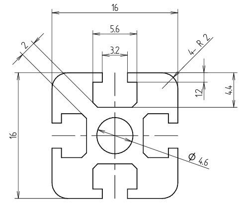

# Standard PLA Frame 16mm x 16mm
This OpenSCAD script generates a PLA frame model that can be printed on a general 3D printer.  

M3 screws can be fixed at any position by inserting M3 nuts into the slits on the side of the frame.  

The variable `Length` defines the total length of the frame. The variable `HoleDia` defines the diameter of the central hole. Default value of `HoleDia` is the outside diameter of the M3 insert nut.  

SPF16AN is a frame fixture. M3 x 6mm cap screws are used for fixing.  

